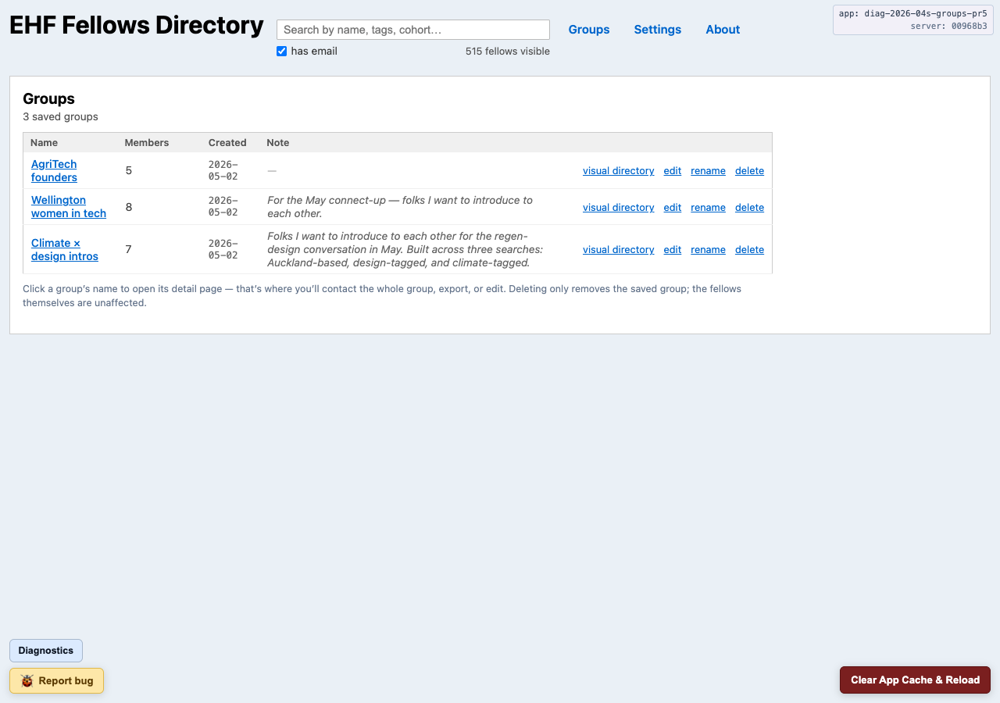
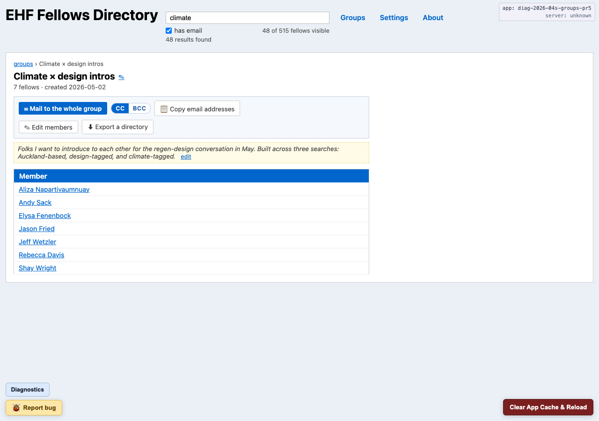
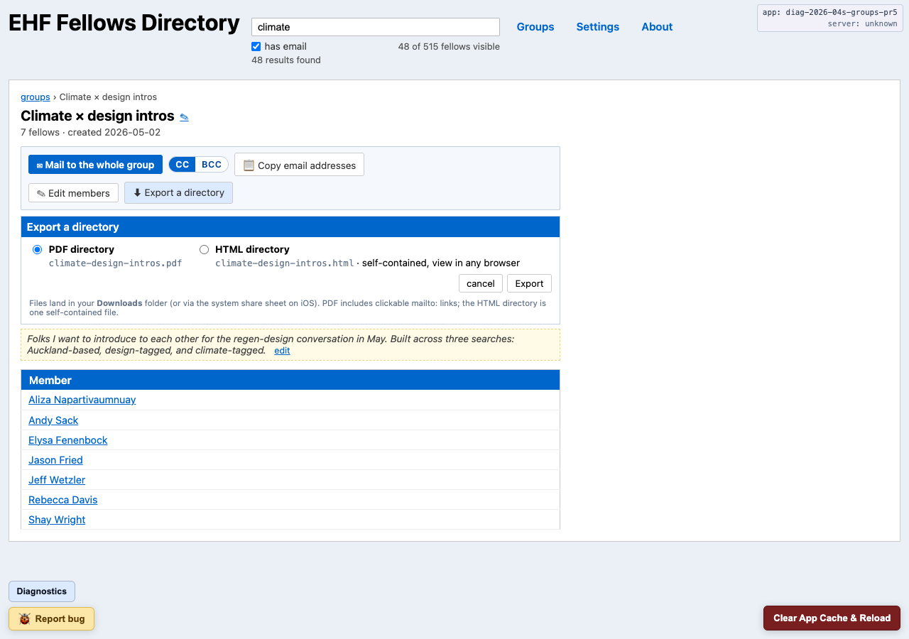
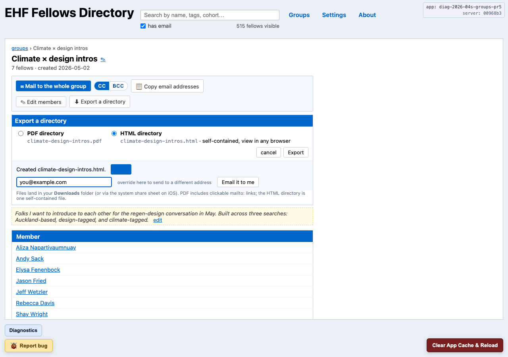
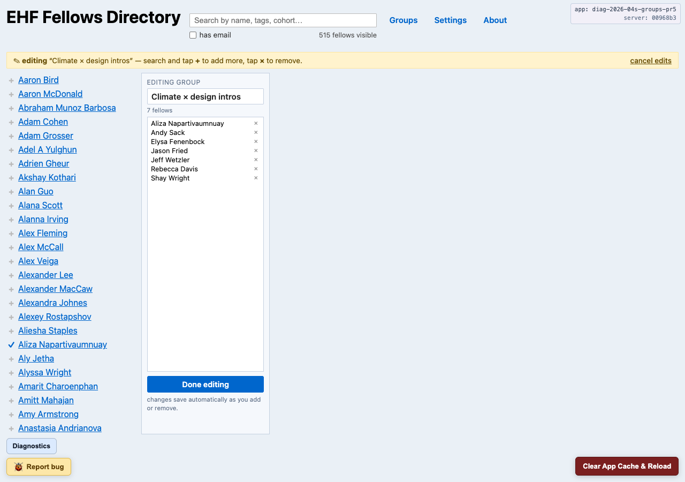
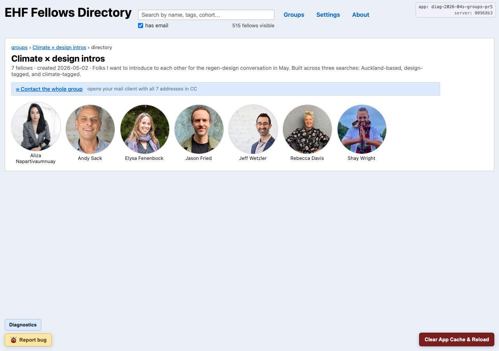
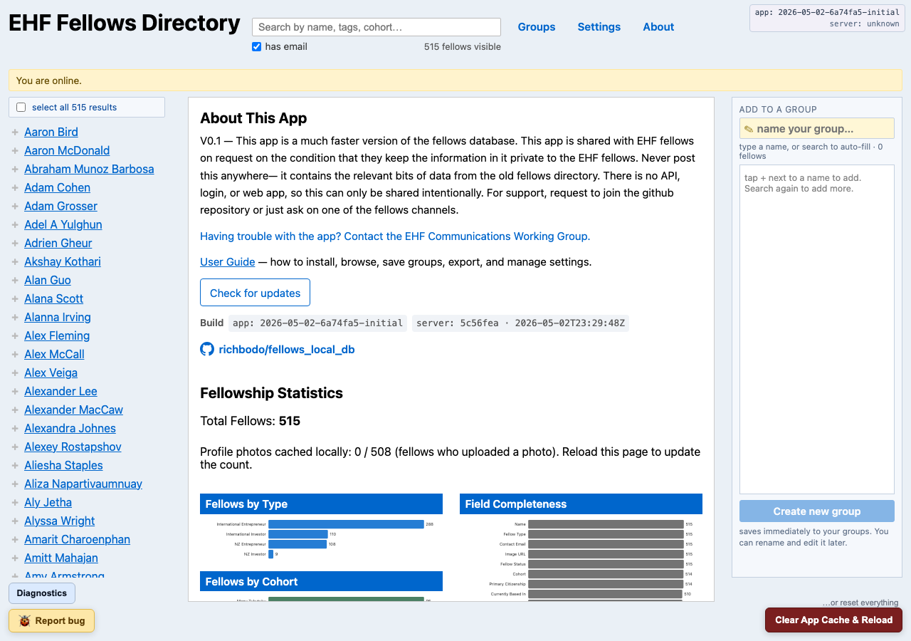

# EHF Fellows Directory — User Guide

A fast local-only directory for EHF fellows.

It's a private, installable web app. Once installed it runs entirely on your
device — fellow data lives in your browser's local storage, so it works
offline. You can group fellows, email a whole group in one click, and
export sub-directories.

The app is distributed only by emailed magic link. Keep the data and any
screenshots inside the fellowship.

---

## Recommended platform

**Chrome (or any Chromium browser) on desktop, plus Claude Desktop
for AI integration.** That combination gets every feature — local
data folder on your disk, MCP integration, the works. The app runs
fine in any modern browser (Safari, Firefox, mobile) but some
features are limited there; check the
[feature ↔ platform matrix](feature_platform_matrix.md) for the
breakdown. Also: **install in one browser per device** — browsers
don't share storage, so two installs = two separate sets of groups
that can't auto-sync.

---

## Installing the app

You'll get a magic link in email. Click it.

1. On the install landing, click **Install app**.
2. Confirm your browser's prompt:
   - **Desktop Chrome / Edge / Brave** — small prompt near the address bar; the
     app opens in its own window.
   - **Android Chrome** — *Add to Home screen*; appears in your launcher.
   - **iOS Safari** — *Share → Add to Home Screen*. (iOS has no one-click
     prompt.)
   - **macOS Safari** — *File → Add to Dock…* (macOS Sonoma 14 or newer).
     Safari doesn't show an in-page install button; the install path is in
     the menu bar.
3. Open the app from its icon. First launch downloads fellow data in the
   background.

Because this app isn't OS-registered, your OS may warn you. Look for
**More info / Details / down-arrow** to install anyway. Ask for help if
stuck.

If **Install app** does nothing, the landing page shows a hint:

- Already installed? Open it from your dock / Applications / home screen.
- Otherwise, click **Use the directory in this tab** — you get the same
  app inside the current tab. Come back later for the install button.

---

## Can't find the app after installing?

Almost always: it installed fine, your OS just put it somewhere unexpected.
**Spotlight** on macOS, **Start menu** on Windows, or your **app launcher**
on Linux is the most reliable way to find it — search for "EHF" and it'll
surface.

The specific gotcha worth knowing: on **macOS with Chrome or Edge**, the app
installs to `~/Applications/Chrome Apps/` — *not* the main Applications
folder. That's a Chromium quirk, not a bug; installing into `/Applications`
would need admin rights. Spotlight (`⌘-Space → "EHF"`) finds it; you can
also drag the icon from `~/Applications/Chrome Apps/` onto your Dock to
keep it one click away.

If Spotlight / Start menu / launcher all come up empty, it probably didn't
install — try *Can't install at all?* below. If that doesn't help either,
file a [GitHub issue](https://github.com/richbodo/fellows_local_db/issues)
(ask Rich for repo access if you don't have it).

And remember: `https://fellows.globaldonut.com` always works in a browser
tab. Once you've installed, the URL skips the install landing and opens
the directory directly — no icon-hunting required.

See *Where the installed app lives* for the full per-platform breakdown.

---

## Can't install at all?

Likely a device-side quirk. Two third-party tools that triage before you
ask for help:

- **[PWAHero](https://pwahero.com/)** — paste the URL; walks you through
  install steps for your specific browser/OS.
- **[Progressier's PWA diagnostic](https://progressier.com/pwa-testing-tool)**
  — green/red checklist of what's missing.

Both are free and don't require sign-in. Send the report to the EHF
Communications Working Group along with what you tried, or file a
[GitHub issue](https://github.com/richbodo/fellows_local_db/issues)
(ask Rich for repo access first if you don't have it).

---

## Where the installed app lives

Launch it like any other app — no browser needed.

| OS | Where the icon shows up |
|---|---|
| **macOS** | Applications folder, Spotlight (`⌘-Space → "EHF"`), `chrome://apps` |
| **Windows** | Start menu → "EHF Fellows Directory"; Edge can pin to taskbar |
| **Linux** | Application launcher (GNOME / KDE), `~/.local/share/applications/` |
| **Android** | Home screen + app drawer |
| **iOS** | Home screen (no app drawer) |

`https://fellows.globaldonut.com` also works in any browser tab; once
you've installed once, the URL skips the install landing and opens the
directory.

---

## Multiple installs on the same device

Each browser installs the app as its own copy with its own private
data. If you install in **Safari**, then later in **Chrome**, your
Mac has *two* "EHF Fellows Directory" apps — same name, same icon,
different homes on disk, different data.

This is intentional browser isolation, not a bug: there's no API
that lets a PWA reach across browser sandboxes. But it can be
confusing if you weren't expecting it.

### What you'll see

- **Spotlight (`⌘-Space → "EHF"`)** shows two (or more) results,
  all identical-looking.
- **Each install has its own data.** Groups, notes, and tags you
  created in Safari aren't visible to the Chrome copy and vice
  versa.
- **The window title** (and the **About** page) shows a unique
  *install name* per copy — something like `giraffe-gorilla-mouse`.
  That's the easiest way to tell which one you opened.

### Tell installs apart in Finder

Each browser puts the `.app` bundle in a different folder, so you
can rename them visibly:

- **Safari** → `~/Applications/EHF Fellows Directory.app`
- **Chrome / Brave / Edge** → `~/Applications/Chrome Apps/EHF Fellows Directory.app`
- **Arc** → managed by Arc, accessed through Arc's sidebar

Right-click each bundle in Finder → **Rename** → give them
distinctive labels like `EHF Fellows — Safari.app` and
`EHF Fellows — Chrome.app`. The renamed labels surface in Spotlight
on subsequent searches.

### Consolidate to one install

If you've accumulated copies and want to keep just one:

1. Open each copy in turn. The **About** page shows its install
   name (and so does the window title).
2. Identify the copy with the data you want to keep (groups
   visible, notes intact).
3. From the copy you're keeping, **Settings → Data folder →
   Choose data folder…**, and pick a folder under your home
   directory. This creates a stable file you can later re-attach
   from any new install. (Folder mode also makes
   [Use with Claude Desktop](use_with_claude_desktop.md) easier.)
4. Uninstall the other copies (steps below).

### Uninstall a copy

Each browser uninstalls its own PWA differently. Below is the short
form; if a step is out of date for your browser version, check the
browser's official help — that's always the canonical reference:

- **Safari (macOS)** — drag `~/Applications/EHF Fellows Directory.app`
  to the Trash. →
  [Apple's Web Apps doc](https://support.apple.com/guide/safari/manage-web-apps-pdsuc1d62cd4/mac)
- **Chrome** — visit `chrome://apps`, right-click the app, **Remove
  from Chrome…**. →
  [Google's PWA management doc](https://support.google.com/chrome/answer/9658361)
- **Edge** — visit `edge://apps`, click **⋯** on the app,
  **Uninstall**.
- **Brave** — same as Chrome but at `brave://apps`.
- **Arc** — right-click in Arc's sidebar, **Delete**.
- **Firefox** — no PWA install on desktop; close the tab and remove
  the bookmark.

**Important:** uninstalling a copy does **not** delete a data folder
you set up. The folder lives on your disk and stays put. To remove
the data too, separately drag the `Fellows/` subfolder you picked
to the Trash. (Auto-backups inside it go with it.)

If you've uninstalled what you thought was the last copy and now
the app appears to be gone, see *Where the installed app lives*
above — Spotlight may surface a copy you forgot about, and the
`https://fellows.globaldonut.com` URL always opens fresh in a
browser tab.

---

## Migrating from another browser

If you've been using the app in one browser (say, Safari) and want
to switch to another (Chrome, for the Claude Desktop integration —
see *[Use with Claude Desktop](use_with_claude_desktop.md)*), your
saved groups and notes don't follow automatically. Browsers don't
share storage; each install starts empty.

Bringing your data across is a two-step copy:

### Step 1 — Export from the source browser

1. Open the app **in the browser where your data currently lives**
   (Safari, in this example).
2. **Settings → ⬇ Download my user data**. Save the `relationships.db`
   file somewhere stable on your disk — `~/Documents/` works well,
   or anywhere you can find again. **Don't put it in Downloads** if
   you regularly empty that folder.

### Step 2 — Import into the new browser

1. Open the app **in the new browser** (Chrome, in this example). If
   you haven't installed there yet, do that first.
2. *(Recommended, Chromium browsers only)* **Settings → Data folder →
   Choose data folder…**. Pick a folder under your home directory.
   This sets up the new browser to keep its `relationships.db` at a
   stable path on your disk — which makes the Claude Desktop
   integration much easier and survives clearing site data.
3. **Settings → ⬆ Restore from a file…**, then pick the
   `relationships.db` you saved in Step 1.

That's it. Your groups, notes, and tags are now visible in the new
browser. The source browser still has its copy — you can keep both
in sync by re-exporting / re-importing, but it's usually simpler to
[uninstall the source copy](#uninstall-a-copy) once you're confident
the new one is working.

**A note for the future.** Doing this two-step migration regularly
is a sign you should pick one browser and stay there. PWAs don't
have a cross-browser sync API, so there's no automatic way to keep
two installs aligned. Pick whichever browser you prefer and treat
the other as a backup.

---

## Where your data is stored

Your groups, notes, and settings live **on your device only** —
never sent to any server, never visible to other apps or websites.

**The recommended setup is a data folder on your disk** — a real
file at a path you pick, visible in Finder/Explorer, durable across
clearing site data or switching browsers. The app prompts you to
set this up via a banner at the top of the screen on first launch.

If you skip the prompt or you're on a browser that doesn't support
folder selection (Safari, Firefox, iOS, Android), the app falls
back to **browser-only mode** — your data still works, but it lives
in private browser storage that can be lost when you clear site
data or switch browsers. Use the **Download a backup** feature
(below) to make file copies you can save anywhere.

### Setting up a data folder (Chrome / Edge / Brave on desktop)

1. Click **Set up data folder** on the banner at the top of the app
   (or go to **Settings → Data folder** → **Choose data folder…**).
2. Your OS pops a folder picker. Pick any folder you like —
   `Documents`, a Dropbox / iCloud / Syncthing folder, anywhere.
3. The app creates a `Fellows/` subfolder inside it and saves
   `relationships.db` there.

The badge at the top of the section flips to **Saved** with the
path and a timestamp, and your data is now a real file you can
browse to. The banner at the top of the screen disappears.

**If `Fellows/` already exists in the folder you picked**, the app
asks before doing anything: open the existing data (the typical
case — reinstalling, or pointing a second browser at a synced
folder), or save your current data into a new `Fellows 2/`
subfolder (the safe choice when you don't recognize what's there).
Cancel leaves both untouched.

After setup, **every change you make is automatically saved to the
folder** — no Save button to remember. You'll see the badge update
each time. The *Save now* button stays as a manual retry if a write
ever fails (badge flips to *Last save failed*). **Refresh from
folder** does the reverse: replace your working data with whatever's
currently in the folder — useful after editing in another browser
or restoring a synced file.

Backups (the `relationships.db.bak.<timestamp>` files in the same
`Fellows/` subfolder) are also automatic — the app keeps the most
recent few alongside the live file. Visible in Finder so you can
copy them out if you want extra safety.

### Badge states

The badge at the top of *Data folder* always tells you the current
state of your data:

- **Saved** (green) — your data is in the folder and the last save
  succeeded.
- **Folder selected — no save yet** (blue) — you've picked a folder
  but haven't saved into it yet. Click *Save now*.
- **Browser-only — your data is not yet saved to a folder** (yellow)
  — default state on a fresh install. Working fine, but not yet
  durable across browser-data clears.
- **Folder set but unreachable — reconnect to keep saving** (yellow)
  — the OS revoked permission to the folder (you moved it, denied
  on session start, or the browser idle-revoked). Your data is fine
  in the browser; click *Reconnect folder…* to grant access again.
- **Last save failed — Retry to save again** (yellow) — the most
  recent write threw an error (disk full, permissions changed
  mid-write). The change is still safe in the browser; click
  *Save now* to retry.
- **Browser-only — this browser doesn't support saving to a folder**
  (yellow) — Safari, Firefox, iOS, and Android Chrome don't ship the
  File System Access API. Use *Download my user data* (below) for
  manual backup instead.

### Backup and restore (works in every browser)

Even when you haven't picked a data folder, you can still grab a
file copy by hand:

- **Download a backup.** Settings → *⬇ Download my user data*. Your
  browser asks you where to save it (Chrome / Edge / Brave on desktop,
  share sheet on iOS / Android) or drops it into your Downloads folder
  (Safari / Firefox).
- **Restore from a backup.** Settings → *Restore from backup →
  Restore from a file* → pick the `.db` file you downloaded earlier.
  The current data is captured into the auto-backup list first, so
  a wrong restore is one click away from being undone.
- **Auto-backups happen on their own.** While you work, the app
  periodically snapshots your data. Pick one with Settings →
  *Restore from backup → Recent auto-backups*.

**What clearing does** (see *Clearing app data* below for the full
breakdown): **Clear App Cache** keeps your data and auto-backups.
**Reset Everything** wipes the in-browser data and auto-backups —
that's why it pops up a *Save a backup first?* dialog. **Reset
Everything does NOT delete the data folder file** — that file lives
on your disk and is yours to keep or remove.

**If you cleared site data and re-installed, but your data folder
is still on disk**, choose the same folder again — the dialog will
offer to *Open existing*, and your groups / notes / tags come back.

**Phone gotchas.** On **Android**, *Clear Storage* for the browser
in Android Settings wipes everything this app has saved, including
the auto-backups. On **iOS**, *Settings → Safari → Clear History and
Website Data* does the same. Both bypass the app's own confirm
dialogs — download a backup yourself before doing either. (Phones
don't yet support the data-folder feature.)

**Switching browsers or devices.** If you set up a data folder
inside a cloud-sync folder (Dropbox / iCloud Drive / Syncthing /
OneDrive), point the new browser at the same folder and pick
*Open existing* — your groups / notes / tags carry over.
Otherwise, download a backup in the source browser, move the file
across (AirDrop, email-to-yourself, USB, cloud drive), then use
*Restore from a file* in the new browser.

---

## The directory

- **Search** by name, tagline, or any keyword — results update as you
  type.
- **Has email** filter (top) is on by default; turn it off to see fellows
  without an email.
- **Filters** button (next to the search input) opens a panel where you
  can narrow the directory by **cohort**, **fellow type**, **region**,
  and **citizenship**. Selections apply immediately; the button shows
  how many filters are active. **Reset** clears them in one tap. Active
  filters are written into the page URL — copy the URL to share a
  filtered view, or reload to come back to the same filtered list.
  (The Filters button is disabled until the directory has finished
  loading the full fellow data; **Search** and **Has email** keep
  working before then.)
- The visible-count line ("142 of 515 fellows visible") tracks the
  current search + filter.
- **📋** beside any email or phone number copies just that value to your
  clipboard — useful when your default mail app is misconfigured and the
  underlined link does nothing.

---

## Fellow detail

Click a name (in the directory or any group) to open the profile. The
**← →** arrows step through the directory alphabetically. The **+**
beside the name drops the fellow into your current selection (see
Groups below); once added it flips to **✕** — tap again to remove.

---

## Groups

Groups let you save a set of fellows for repeat workflows — emailing a
cohort, exporting a sub-directory, tracking who you've reached out to.
They live on your device, never sync to a server, and survive **Clear
App Cache**.

### Composing a group

The directory page is where you build groups.

1. Search or filter.
2. Tap **+** beside a fellow (it flips to **✕** once they're in the draft).
3. Run another search — your selection persists.
4. Name the group and click **Create new group**.

**Selection persists across searches** is the part most people miss.
Browse a few different slices in one sitting (region, topic, name) and
pick from each. Until you type a name, the rail auto-names the group
after your most recent search.

On phones the composer is a bottom-sheet behind a "N SELECTED" floating
button. Drafts in progress survive a tab close (cleared by **Clear App
Cache** — drafts are unsaved by definition).

### Browsing your groups

`#/groups` (or **Groups** in the nav). Newest-touched first, with a
member count beside each.

### Group detail

`#/groups/<id>` shows the group's title, member list, free-text note,
and an action bar.

- **Rename** — pencil ✎ next to the title.
- **Note** — auto-saves on edit.
- **view as visual directory** — small text link below the title opens
  the yearbook-style portrait grid for the same group (see below).
- **Delete** — kebab → *Delete*; confirms before removing. Only the
  group is deleted; fellows themselves are untouched.

### Emailing a group

The most common next step after creating a group.

1. Click **✉ Mail to the whole group**.
2. (Optional) Toggle **CC / BCC** — BCC if you'd rather members not see
   each other.
3. Your default mail client opens with every member's email pre-filled.

Long lists may be split across multiple drafts to fit your mail client's
address-line limit. If the mail link does nothing (mis-configured
default client), click **📋 Copy email addresses** for the same
comma-separated list on your clipboard — paste anywhere.

### Exporting a group

Click **⬇ Export a directory**. Two-phase flow:

1. Pick **PDF** or **HTML** and click **Export**. The file lands in your
   Downloads folder.
2. The panel reveals a **View** link and **Email it to me** button.
   Override the recipient if you want it sent elsewhere; the mail
   client opens with a draft to that address. Attach the file from
   Downloads before sending — browsers can't attach files to a `mailto:`
   automatically.

### Editing members

Click **✎ Edit members** on the detail page. A yellow banner across the
top confirms which group; the directory list returns on the left for
picking; the rail flips to **editing group / Done editing** with the
current members pre-filled.

Every add/remove **auto-saves**. Two exits:

- **Done editing** — keep the changes.
- **Cancel edits** — revert to where this edit session started.

### Visual directory

`#/groups/<id>/directory` shows the group as a yearbook-style portrait
grid. The bar at the top has the same **Mail to the whole group**
action as the detail page.

---

## Settings

`#/settings`.

- **Your email ("me" email)** — used by export "Email it to me" and any
  other place the app addresses something *to you*. Auto-captured from
  your magic link, so most people never need to touch this.
- **Your saved data → Download my user data** — saves all your groups,
  notes, tags, and settings to a single `.db` file. Your browser
  opens its native save dialog (Chrome / Edge / Brave on desktop) or
  share sheet (iOS / Android) so **you choose where the file goes**;
  on Safari and Firefox the file lands in your Downloads folder. The
  app also auto-snapshots the same file before every upgrade and
  keeps the newest 3.
- **Restore from backup → Restore from a file** — replace your current
  saved data with a previously downloaded `.db`. The app shows a
  confirmation summary ("4 groups, 12 notes → 7 groups, 23 notes —
  Continue?") and only swaps once you say yes. Your pre-restore state
  is captured into the auto-backup list, so a wrong restore is one
  click away from undo.
- **Restore from backup → Recent auto-backups** — every snapshot the
  app has on this device. Each row shows when it was taken and what's
  inside (groups · notes · tags). **Restore this** rolls back to that
  snapshot.

Settings survive both app updates and **Clear App Cache**.

---

## About

`#/about` shows fellowship statistics (totals, breakdowns by region /
cohort / fellow type) plus a two-line update status block:

- **App** — the build label running in this tab.
- **Directory data** — when fellows.db was last fetched.

Click **Check for updates** to ask the server about both. Each row
updates independently:

- *up to date* — nothing to do.
- *App update available* — a newer app version is on the server. A
  **Reload to apply** button appears next to the row; clicking it is
  the same as clicking the *New version available* banner.
- *Directory Data update available* — the bundled fellow data on the
  server differs from the snapshot on this device. An **Update
  directory data** button appears. See *Updating directory data*
  below.
- *Couldn't check (offline?)* — the server didn't respond. Try again
  when you're online.
- *Reload the app to enable update checks* — appears briefly right
  after an app update if the previous service worker was still running
  when the page loaded. A single reload spawns a fresh background
  worker and the check works.

A line below the block shows when fellow data was last fetched (or
the most recent failure), e.g. *"Last update check: 2026-05-04T18:22:07Z
— succeeded."* — useful when a fellow asks "am I seeing the latest
data?".

### Install name

Below the support and help links, the About page shows a line like:

> This install: **giraffe-gorilla-mouse**

That's an auto-generated name unique to this copy of the app. It's
also tacked onto the window title bar, so it's visible without
opening the About page.

**Why it's there.** If you install the app in more than one browser
(or more than one browser profile), each install has its own data
and its own name. The install name is the easiest way to confirm
which copy you have open when something looks off. See
[Multiple installs on the same device](#multiple-installs-on-the-same-device)
above for the rest of the story.

**What changes the name:**

- *Reset Everything* generates a new name (it's a fresh start in
  every other respect, too).
- *Clear App Cache* keeps your name.
- Reloading the page, restarting the browser, app updates — all
  keep your name.
- The name doesn't carry over to a different browser or device —
  each install gets its own.

The name is entirely local. It isn't sent anywhere, doesn't identify
you, and isn't tied to any account. If you ever
[file a bug report](#reporting-a-bug), the install name is
automatically included so the maintainer can join the report to the
right install.

---

## Use with Claude Desktop (optional)

You can plug the directory into **Claude Desktop** so you can ask Claude
things like *"who's in my Climate Action group?"* or *"draft an invite
email to my Climate Action group — don't send, just stage it for me to
review."* Claude reads your local fellows data to answer, and hands
email drafts back to you to review and send.

See [Use with Claude Desktop](use_with_claude_desktop.md) for the
step-by-step setup walkthrough. Optional — the Fellows app itself
doesn't need any of this.

---

## Updates

The app handles two kinds of updates separately. Both are surfaced on
the **About** page; you can click **Check for updates** at any time to
re-check.

### App updates

The app shell (UI, layout, fixes) auto-checks for new versions — at
every launch, and once an hour while open. When one's available a
banner reads *"New version available — Reload."* Click Reload. The
About page shows the same state alongside an inline **Reload to
apply** button.

Reloading replaces only the app. Your saved groups, notes, settings,
and the fellow data on this device are untouched.

### Directory data updates

The fellow data on this device — names, profiles, contact info — is a
snapshot. **By design it does not change automatically.** Once
installed, the directory you see is yours: a fellow's profile won't
shift mid-session, and your saved groups will keep referring to the
same people.

When the server's snapshot differs from yours, the About page's
*Directory data* row shows **Directory Data update available** and an
**Update directory data** button.

Before applying the update, the app checks whether any of your saved
group members would disappear from the new snapshot. If so, a confirm
dialog lists them by name and group, e.g.:

> *This update removes 2 fellows from your saved groups:*
> *• Alice Smith — in 'NZ Mentors', 'Investors'*
> *• Bob Jones   — in 'NZ Mentors'*
>
> *After the update they will no longer appear in those groups.
> Their entries will be flagged as 'Profile no longer available' so
> you can review and remove them.*
>
> *[Cancel] [Update anyway]*

If no members would disappear, the update applies silently and the
status flips to *Directory data updated.*

After an update, members whose profile is no longer in the directory
render in group detail as **Profile no longer available (record_id:
…)** with a per-row **Remove** button. The data isn't lost — it's just
no longer in the active snapshot. You can leave the row in place
(harmless) or click **Remove** to drop it from the group.

The same row also appears with a small *(fellow data unavailable)*
note anywhere else the group surfaces — composer rail when editing,
visual directory grid, and PDF / HTML exports — so you can spot the
gap without opening group detail.

---

## Clearing app data

Two reset paths if the app gets weird. Try the gentle one first.

|  | Clear App Cache | Reset everything |
|---|---|---|
| Wipes the cache, signs you out | ✓ | ✓ |
| Wipes saved groups, notes, tags, settings | — | ✓ |
| Wipes the on-device fellow data snapshot | — | ✓ |
| Lands you at | the install landing | the email gate |

- **Phone / tablet** — top-right **⋮** kebab → either option.
- **Desktop** — bottom-right red **Clear App Cache & Reload** button;
  *…or reset everything* small link just above it.

A confirm dialog spells out what's lost before it runs. In-progress
group drafts are lost in either reset (drafts are unsaved by
definition).

**Reset Everything offers a backup first.** Because Reset Everything
wipes your saved groups, notes, and settings — including the
auto-backups stored alongside them — clicking it pops up a *Save a
backup first?* dialog with three options:

- **⬇ Download backup & continue** — downloads the same `.db` file
  Settings → *Download my user data* produces, then proceeds to the
  destructive confirm. Safe choice if you might want to restore later.
- **Skip — no data to save** — for clean installs or when you don't
  care about losing the data. Goes straight to the destructive confirm.
- **Cancel** — backs out without resetting anything.

After a reset, install the app again from a fresh magic link, then
Settings → *Restore from backup → Restore from a file* → pick the
`.db` you downloaded.

### When the directory hangs at "Loading…"

Rare, but it can happen — usually a stuck service worker or an
unresponsive local database after a deploy. After about 20 seconds of
no progress the app replaces the loading message with a recovery
panel that names the last completed phase and gives you three options:

- **Reload** — try again with a fresh page load. Fixes most stuck
  service-worker cases on its own.
- **Clear App Cache & Reload** — same as the red button at the
  bottom of the page. Wipes the shell cache and signs you out, but
  keeps your saved groups and the on-device fellow data.
- **Send report to the maintainer** — opens the bug-report dialog
  pre-filled with the boot trace so we can see where it stalled.

Try Reload first; if that doesn't help, Clear App Cache. Send the
report if both fail — that's the case where we want to hear about it.

---

## Reporting a bug

Click **Report a bug** (small button bottom-left on desktop; kebab →
*Report a bug…* on mobile). The dialog pre-fills your browser, OS,
build SHA, [install name](#install-name), and the most recent app
errors. Add a one-line description and submit; it lands in the
maintainer's log.

If you're stuck at the email-gate page (no link arriving, error on
submit), the gate has its own diagnostics block:

- **Copy diagnostics** — to clipboard; paste into chat / email along
  with the time you tried.
- **Send diagnostics** — one-tap to the maintainer's log. Your email
  and IP are **never sent** — only browser / OS, recent requests, build
  SHA, and a non-reversible 12-char hash of your address (so we can
  find which sign-in attempt failed). Sanitization happens server-side
  in
  [`deploy/client_error_sanitizer.py`](https://github.com/richbodo/fellows_local_db/blob/main/deploy/client_error_sanitizer.py).

Prefer GitHub? File an issue at
[github.com/richbodo/fellows_local_db/issues](https://github.com/richbodo/fellows_local_db/issues)
— useful when you want a thread to track the fix in, or when the in-app
report can't reach the server. Ask Rich to add you to the repo if you
don't have access yet.

---

## Offline

The app is local-first by design. Once installed, it runs entirely on
your device — fellow data, your saved groups, your notes, your
settings. No login, no server round-trip on each click. Photos that
finished caching are available; the rest show a placeholder until you
get a chance to fetch them.

If you ever wonder whether the app has reached the server recently,
the **About** page shows the timestamp of the last successful fetch
under **Check for updates**. Picking up new fellows, fixes, or a
refreshed profile is opt-in — see *Updates → Directory data updates*
above. If your session has expired, visit `/?gate=1` for a new magic
link.

---

## Supported browsers

Saved groups and settings need OPFS (a recent browser storage API).

- **Chrome / Edge** 102+ (May 2022)
- **Safari** 16.4+ on macOS 13.3+ / iOS 16.4+ (March 2023)
- **Firefox** 111+ (March 2023)

Older browsers can still browse the directory and read profiles;
creating groups will show a panel explaining what to do. Every browser
on iOS uses Safari's engine, so Chrome / Firefox on iPhone won't help —
update iOS itself (iPhone 8 and newer support 16.4+).

---

## Getting help

- **General questions** — fellows channels, or EHF Communications
  Working Group.
- **Bug reports / feature requests** — file a
  [GitHub issue](https://github.com/richbodo/fellows_local_db/issues)
  (you'll need to be added to the repo first — ask Rich). The same
  GitHub link is on the About page.
- **Lost or expired install link** — request a fresh one from the
  operator.

---

## Privacy

This app ships fellows' contact info and free-text responses. It is
**not** a public service. Keep screenshots and data inside the
fellowship.
