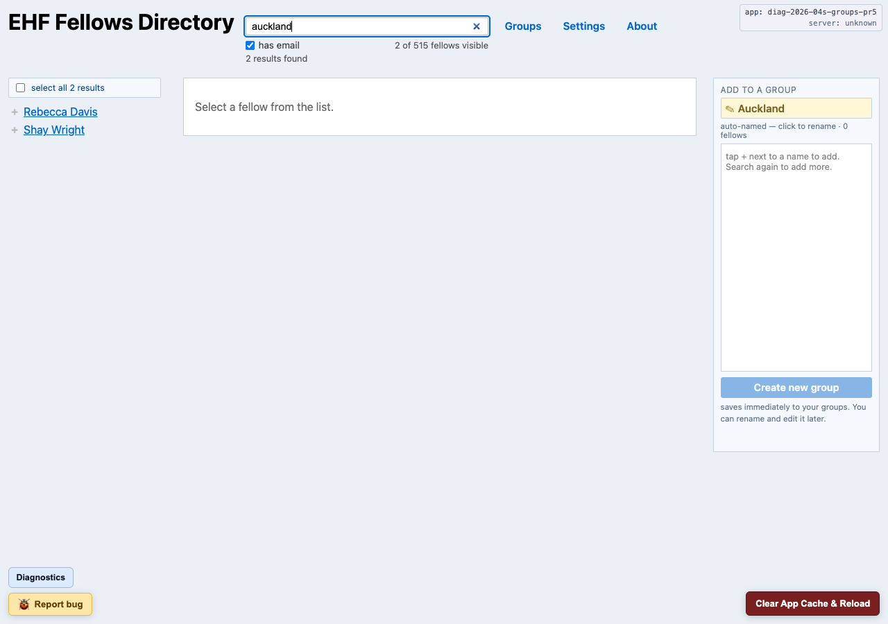

# EHF Fellows Directory — User Guide

A short, practical guide for fellows using the installed app. For a deeper
technical tour, see [`Architecture.md`](Architecture.md).

---

## What this app is

A private, installable directory of Edmund Hillary Fellowship fellow
profiles. Once installed, the app runs locally on your device — the fellow
data lives in a local database inside your browser's app storage, so you
can browse the directory even when you're offline. You can also save your
own **groups** of fellows for quick contact and export, and store a few
small **settings** (like the email you want exports addressed from).

The app is only distributed to EHF fellows, by emailed magic link. Please
keep the data confidential and do not share the link or screenshots
outside the fellowship.

---

## Installing the app

You are going to start by getting a magic link in email.  Once you click on that,
you will be able to install the app, however:

What follows are some pretty generic instructions.  The reality is that you will want
to install an application icon for the PWA on your desktop, and because this app
is not registered with your OS (MacOS, iOS, etc), your OS will complain, most 
likely, about that.  There will still be a way to get it installed, but you might 
have to click around and see if there is a "details" or "more info" or a down arrow 
somewhere that would allow you to make the exception for this app and 
install it anyway.  Do that.  Ask for help.

1. Click the install link in your email. You'll land on a page titled
   **"Install EHF Fellows Directory."**
2. Click **Install app**.
   - On **desktop Chrome / Edge**: a small install prompt appears near the
     address bar — confirm it. The app opens in its own window.
   - On **Android Chrome**: the prompt offers **Add to Home screen**. Accept
     it; the app shows up as an icon in your launcher.
   - On **iOS Safari**: tap the **Share** button, then **Add to Home
     Screen**. (iOS doesn't support the one-click install prompt.)
3. Open the installed app. The first launch downloads fellow data in the
   background — you should see photos filling in over a minute or so on a
   normal connection.

If clicking **Install app** doesn't bring up an install prompt, the
landing page shows a hint with two options:

- If you've already installed this app on this device, open it from your
  dock, Applications folder, or home screen (the install prompt is
  suppressed for already-installed PWAs).
- Otherwise, click **Use the directory in this tab** below the install
  button to start using the app immediately in the current browser tab.
  Search, profiles, and groups all work — it just lives inside the
  browser instead of as a standalone app icon.

The "in tab" path is also a graceful fallback for older browsers that
can't run the install prompt at all. You can always come back and try
the install button later — your browser may need more engagement before
it offers the prompt.

---

## Can't install at all?

If you've followed the install steps and the app still won't install on
your device — no install prompt appears, an "Older version of Android"
error pops up, or just nothing happens after tapping the install link
— it's almost always a device-side quirk rather than a problem with
the app itself. Two third-party tools that help triage before
contacting support:

- **PWAHero** — paste the app URL and it walks you through install
  steps tailored to your specific browser and OS. Best for "I'm not
  sure what to tap on this device."
- **Progressier's PWA diagnostic** — a green/red checklist that flags
  exactly which install requirement isn't being met on your device.
  Best for "I want to know what's broken before asking."

Both are free, web-based, and don't require sign-in. Search either
name in your browser to find the current URL.

If neither helps, contact the EHF Communications Working Group with
the output from one of those tools (a screenshot of the report is
enough) — that gives us a head start on the triage instead of
starting with "what device are you on?"

---

## Where does the installed app live?

A PWA install drops an icon on your device so you can launch the app like
any other app — you don't need to type the URL or open a browser to use
it day-to-day.

- **macOS (Chrome / Edge)**: the app appears in your **Applications** folder
  and in Spotlight (Cmd-Space, type "EHF"). Also listed under Chrome's
  **Apps** at [chrome://apps](chrome://apps).
- **Windows (Chrome / Edge)**: look in the **Start menu** under "EHF Fellows
  Directory". Edge also offers to add a taskbar shortcut during install.
- **Linux (Chrome / Edge)**: appears in the application launcher (GNOME
  Activities, KDE Kickoff) and under `~/.local/share/applications/`.
- **Android (Chrome)**: added to the **home screen** (unless you declined)
  and always available in the app drawer.
- **iOS (Safari)**: added to the **home screen**. iOS has no app drawer.

Clicking/tapping the icon opens the app in its own window — no browser
chrome, runs offline from cached data.

---

## Two ways to launch

You have two doors to the same app. Pick whichever is easier:

1. **The installed app icon** (preferred). Opens in its own window, runs
   cleanly offline, and doesn't need a browser to be running. This is the
   "real" app; treat it like any other desktop / mobile app.

2. **The URL — https://fellows.globaldonut.com — in any browser tab**. If
   you've already installed the app on this browser profile, the URL opens
   the directory directly (same data, same UI, inside a regular tab). This
   is handy when:
   - You want to open the app on a device where the icon isn't obvious.
   - You clicked a link from a chat or email.
   - You bookmarked the URL.

The *first* visit from a browser profile always starts at the install
landing. Once you've installed and used the app once, later URL visits
skip the install landing and go straight to the directory.

---

## Using the directory

- **Search** by name, tagline, or any keyword. Results update as you type.
- **Has email** filter (top of the directory) is on by default — it hides
  fellows the app can't reach by email. Turn it off to see everyone.
- **Profile photos** are cached on your device after the first load, so
  scrolling is fast and works offline.
- The visible-count text (e.g. **"142 of 515 fellows visible"**) shows how
  many fellows match your current search + filter.
- **Copy contact info.** Every email and phone number on a fellow's profile
  (and inside the visual-directory contact card) has a small **📋** button
  next to it. Click it to copy that one value to your clipboard — handy if
  your default mail client is misconfigured and the underlined link does
  nothing when you click it.

---

## Groups

Groups let you save a set of fellows for repeat workflows: contacting a
cohort, exporting a sub-directory, or just keeping track of who you've
already reached out to. Groups live entirely on your device — they're
per-browser, never synced to a server, and survive **Clear App Cache**.

### Composing a group — the easy way

The directory page is also where you build groups. The flow:

1. Search or filter the directory.
2. Tap **+** beside a fellow to add them to your selection.
3. Run a different search and add more.
4. Name the group and click **Create new group**.

**Your selection persists across searches.** That's the part most
people miss at first — you don't have to find every fellow with one
clever search. Browse three or four different slices of the directory
in one sitting (one search by region, one by topic, one by name) and
pick the people you want from each. Until you type a name, the rail
auto-names the group after your most recent search; type your own name
any time to override.

You can also add and remove members from a saved group later — see
[Editing a group](#editing-a-group) — but most groups start with this
compose-while-you-search flow. Editing is for adjusting an existing
group, not the usual way to build one.

#### Where the composer lives

- **Desktop**: a fixed right-side rail (visible in both screenshots
  above). Fellows in your selection show with × to remove; fellows
  already in the selection show a checkmark instead of + in the
  directory list.
- **Phone or tablet**: a **floating action button** in the bottom-right
  shows your current count (e.g. "3 SELECTED"). Tap it to slide the
  composer up as a bottom sheet; tap outside, press **Esc**, or tap ×
  to dismiss.

Drafts in progress are kept in browser storage, so you can close the
tab and come back to the same selection later. (The draft is cleared
when you click **Clear App Cache**, since it's by definition unsaved.)

### Browsing your groups

Open `#/groups` (or use the **Groups** link in the navigation). The page
is a focused view — the directory list and the selection rail step out
of the way so the saved groups are what you see. They're listed
newest-touched first, with a member count beside each. Click a group's
name to open its detail page; click **visual directory** to jump
straight to its portrait grid (see below).

On a phone or tablet, each group renders as a card with the group name,
member count + creation date, the note (if any), and three actions:
**▤ Visual** (jump to the visual directory), **✎ Edit** (enter
edit mode), and a **⋮** kebab that opens **Rename** and **Delete**.
On desktop the same data renders as a table; the actions are inline.

### Group detail

The detail page (`#/groups/<id>`) is a **focused view** — the directory
list on the left and the selection rail on the right step out of the way
so you can concentrate on this one group.

- **Title with rename** — click the small **✎** pencil next to the
  group's name to rename it in place. **Save** commits, **Cancel** (or
  pressing **Esc**) discards the change.
- **Member list** with each fellow's name. Clicking a name opens the
  fellow's profile.
- **Note** — a free-text field below the member list. Edit inline; saves
  automatically.
- **Action bar.** Carries every group-level action.
  - On desktop the bar sits below the note and is laid out in two
    rows: **Row 1 — ✉ Mail to the whole group** + a **CC/BCC** pill
    toggle + **📋 Copy email addresses**. **Row 2 — ✎ Edit members**
    + **⬇ Export a directory**.
  - On a phone or tablet the bar is **pinned to the bottom of the
    screen** and shows just the two primary verbs inline: **✉ Mail**
    and **⬇ Export**. A **⋮** kebab on the bar opens a sheet with
    **CC / BCC** (radio), **📋 Copy email addresses**, and **✎ Edit
    members**. Same actions, just folded so the bar stays thumb-sized.

  *Mail* opens your default mail client with every member's email
  address pre-filled (in CC by default; switch to BCC if you'd rather
  members not see each other). Long member lists may be split across
  multiple draft emails to fit your mail client's address-line limit.
  *Copy email addresses* puts the same comma-separated list on your
  clipboard — useful when your mail client isn't set up to handle the
  Mail link, or when you want to paste into a different tool.

### Visual directory

`#/groups/<id>/directory` (or the **visual directory** row link from the
groups index) shows the group as a full-page alphabetical grid of
portrait tiles — closer to a yearbook layout than a list. Click any
portrait or name to open that fellow's profile. The lavender bar at the
top has the same **Mail to the whole group** action as the detail page,
so you can email the whole group from this view too.

Portraits that didn't download fall back to a silhouette placeholder.

### Editing a group

Click **✎ Edit members** on the detail page (or visit `#/edit/<id>`).
You'll see:

- A **yellow banner** across the top of the app reading "editing group: …".
- Edit mode is **rail-driven**: the directory list returns on the left
  for picking fellows, the selection rail on the right flips into
  **editing group / Done editing** mode and pre-fills with the group's
  current members. The center pane stays out of the way.
- Every add/remove **auto-saves** immediately. There's no separate "save"
  button.
- Two ways to exit:
  - **Done editing** — keeps everything you changed.
  - **Cancel edits** — reverts to the membership you started this edit
    session with. Anything you toggled in this session is undone; earlier
    saves are unaffected.

(Renaming the group also works from this page — the rail's name field is
the same group name. The pencil ✎ on the detail page is the primary
affordance; this is a secondary path.)

### Deleting a group

From the group detail page, use the **Delete** action. You'll be asked to
confirm. Only the saved group is removed; the fellows themselves are
untouched, and any other groups they belong to are untouched.

### Exporting a group

Click **⬇ Export a directory** on the group detail page. Exporting is a
**two-phase** flow:

1. Pick a format and click **Export**:
   - **PDF** — a printable directory generated locally.
   - **HTML** — a single self-contained `.html` file you can archive or
     forward offline.
   The button shows "Exporting…" while the bundle is built in your
   browser. When it's done, the file lands in your **Downloads** folder
   (or via the system share sheet on iOS).
2. After Export completes, the panel reveals a **View** link (opens the
   file in a new tab) and an **Email it to me** button alongside an
   email field. The field prefills from the **"me" email** in Settings;
   override it for this export if you want it sent somewhere else.
   Clicking **Email it to me** opens your mail client with a draft
   addressed to that address — you attach the file from your Downloads
   folder before sending. (Browsers can't attach files to a `mailto:`
   automatically.)

---

## Settings

Open `#/settings` (linked from the navigation).

- **Your email ("me" email)** — used by group export, "email it to me"
  links, and any other place the app needs to address something *to you*.
  It's auto-captured the first time you sign in via a magic link, so most
  users will never need to touch this page. Override it here if you'd
  rather receive exports at a different mailbox than the one you sign in
  with.
- **Your saved data → Download my user data** — saves a single file
  (`relationships-<date>.db`) to your Downloads folder containing all
  your saved groups, group notes, fellow tags, and settings. Useful as
  a backup before a major change, or if you want to keep an off-device
  copy. The app also auto-snapshots the same file before every app
  upgrade and keeps the newest 3 — Diagnostics shows the current list.
  (A user-facing **Restore** flow isn't built yet — if you ever need to
  recover from a backup, contact the maintainer.)

Settings are stored in the app's local user-data store and survive
both app updates and **Clear App Cache**.

---

## Updates

The app checks for new versions automatically:

- **On every launch**, the service worker compares against the server.
- **Once an hour** while the app is open, a background check confirms
  you're still on the latest build.
- You can also force a check from the **About** page → **Check for
  updates**. The same About page shows the **Build** line (the app
  constant your tab is running and the server SHA + timestamp it last
  fetched), which is handy when reporting a bug or confirming a deploy
  reached you.

When an update is available, a banner appears across the top of the app:
**"New version available — Reload."** Click Reload to apply it.

---

## Clearing app data

If the app gets into a weird state (corrupt cache, stuck banner, stale
data), there are two reset paths. Try the first one first.

### Clear App Cache (gentle reset — preserves your groups)

- **On a phone or tablet:** tap the **⋮** kebab in the top-right of the
  app bar → **Clear app cache & reload**. Confirm.
- **On desktop:** click the red **Clear App Cache & Reload** button in
  the bottom-right corner. Confirm.

The app wipes its local cache, signs you out, and reloads. The same
kebab menu also holds **Diagnostics…** and **Report a bug…**, which on
desktop appear as separate floating buttons.

**Heads-up:** clearing the cache also re-downloads the fellow data and
photos on the next launch, and signs you out — so if the server asks
for auth again you'll need your install link (or a fresh one). The app
preserves a small "you've been here before" marker so the URL still
opens the directory directly and a future server outage won't strand
you at the error panel.

**What survives a cache clear:** your saved groups, your group notes,
and your Settings (e.g. your "me" email). These live in a separate
local store from the app cache and aren't touched by this button. An
in-progress group draft *is* lost — drafts are by definition unsaved.

### Reset everything (nuclear — also wipes your groups)

If Clear App Cache didn't fix the problem, the next escalation is
**Reset everything**. This wipes the local store too, so your saved
groups, group notes, fellow tags, and Settings are deleted along with
the cache.

- **On a phone or tablet:** same kebab → **Reset everything (lose
  groups & settings)** at the bottom of the sheet. Confirm.
- **On desktop:** the small underlined **…or reset everything** link
  just above the red Clear App Cache button. Confirm.

A confirm dialog spells out what's being lost before it runs. Use this
only when the gentle reset hasn't helped — for example, the directory
is showing stale or wrong data after multiple Clear App Cache attempts,
or the app is stuck on a "can't open groups on this browser" panel
that you suspect is a corrupted local store rather than a real browser
limit.

After Reset everything you'll come back to the email gate as if it were
your first visit. Sign in again with your magic link. The directory
will re-download; your groups will not — they're gone.

---

## Offline behaviour

- Once installed and first-loaded, the directory works fully offline.
- Photos that finished caching are available offline; photos that never
  downloaded show a placeholder until you're back online and the prewarm
  catches up.
- If the server is temporarily unreachable (flaky connection, deploy
  blip), the build badge at the top of the app flips to **"server:
  unreachable."** This is informational — the app keeps working.
- If your session has expired (e.g., you haven't opened the app in a
  long time), the app still opens and shows your cached directory from
  the last time you loaded it. The build badge reads **"server: offline
  · using cache."** You can keep browsing normally. To get fresh data
  (new fellows, updated profiles), visit `/?gate=1` and request a new
  magic link.

---

## Supported browsers

Saved groups and settings are stored locally on your device using a
browser feature called OPFS. Most modern browsers support it, but a
few older ones don't — you'll still be able to browse the directory,
search, and read fellow profiles, but creating groups or saving
settings will show an "Can't open groups on this browser" panel
explaining what to do.

If you can, run one of these or newer:

- **Chrome 102+** (May 2022 or later)
- **Edge 102+** (May 2022 or later)
- **Safari 16.4+** on **macOS 13.3+** or **iOS 16.4+** (March 2023 or later)
- **Firefox 111+** (March 2023 or later)

A note about iPhone and iPad: every browser on iOS uses Safari's
underlying engine, so installing Chrome or Firefox on an iPhone won't
help. The fix is to update iOS itself (iPhone 8 and newer support
iOS 16.4+). If your device can't be updated, you can still use the
directory and profiles — just open the app on a desktop or laptop
when you want to use groups.

If you hit the "Can't open groups on this browser" panel and the
suggestions there don't work for you, please reach out — we're happy
to help.

---

## Getting help

- **General questions**: ask on one of the fellows channels, or contact
  the EHF Communications Working Group.
- **Bug reports / feature requests**: open an issue on the GitHub repo
  (link on the About page). You'll need to be added to the repo first —
  ask Rich.
- **Install link expired or lost**: request a fresh one from the
  operator.
- **Stuck at the email-gate page** (no link arriving, error on submit, or
  any other "I can't get in"): the gate shows a small diagnostics block
  below the form with your browser, OS, viewport, and the most recent
  request. You have two options:
  - **Copy diagnostics** — copies the block to your clipboard so you can
    paste it into a chat message, an email, or anywhere else along with
    the time you tried. That's enough for us to find the matching
    server-side log entry.
  - **Send diagnostics** — one-tap version of the same thing. The block
    is sent directly to the maintainer's server log. Your email and IP
    address are **never sent**; only your browser/OS, the recent
    requests the app captured, and the build SHA. (If you've just
    submitted an email and are getting "Could not send", an opaque
    12-character hash of your address is included so we can find which
    sign-in attempt failed — but the hash isn't reversible to your
    actual address.) Sanitization happens server-side in
    [`deploy/client_error_sanitizer.py`](https://github.com/richbodo/fellows_local_db/blob/main/deploy/client_error_sanitizer.py)
    if you want to see exactly what the rules are.

---

## Privacy

The app ships a dump of fellow contact info and free-text responses. It
is explicitly **not** hosted as a public service — distribution is by
individual invitation. Keep screenshots and data within the fellowship.
